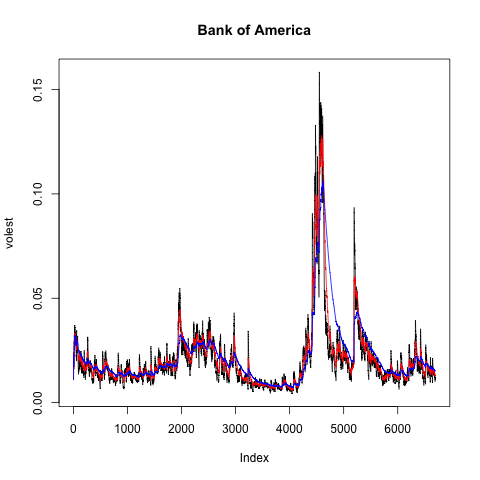

Stock Volatility
----------------

The volatility of the returns of Bank of America is analyzed in the
present document.

The data is retrieved from Yahoo Finance. The ticker in yahoo finance
for Bank of America is BAC.

The information regarding this project can be found in github at:
<https://github.com/ecarrerasmu/StockVolatility>

    library(tseries)
    #set the working directory to a local machine
    setwd("~/Documents/Master Data Science/Doing Data Science/Session11/Homework11")
    getwd()

    ## [1] "/Users/ernestcarrera/Documents/Master Data Science/Doing Data Science/Session11/Homework11"

    BAdata <- get.hist.quote('bac',quote="Close")

    ## 'getSymbols' currently uses auto.assign=TRUE by default, but will
    ## use auto.assign=FALSE in 0.5-0. You will still be able to use
    ## 'loadSymbols' to automatically load data. getOption("getSymbols.env")
    ## and getOption("getSymbols.auto.assign") will still be checked for
    ## alternate defaults.
    ## 
    ## This message is shown once per session and may be disabled by setting 
    ## options("getSymbols.warning4.0"=FALSE). See ?getSymbols for details.

    ## 
    ## WARNING: There have been significant changes to Yahoo Finance data.
    ## Please see the Warning section of '?getSymbols.yahoo' for details.
    ## 
    ## This message is shown once per session and may be disabled by setting
    ## options("getSymbols.yahoo.warning"=FALSE).

    ## time series ends   2017-07-28

The log of returns are calculated

    BAret <- log(lag(BAdata)) - log(BAdata)

A function to calculate the volatility over the entire series,
exponentially lookback window. d represents the number of values we go
back in time

    BAvol <- sd(BAret) * sqrt(250) * 100

    ## volatility
    get

    ## function (x, pos = -1L, envir = as.environment(pos), mode = "any", 
    ##     inherits = TRUE) 
    ## .Internal(get(x, envir, mode, inherits))
    ## <bytecode: 0x7fcdab3b9708>
    ## <environment: namespace:base>

    Vol <- function(d, logrets)
    {
      
      var = 0
      
      lam = 0
      
      varlist <- c()
      
      for (r in logrets) {
        
        lam = lam*(1 - 1/d) + 1
        
        var = (1 - 1/lam)*var + (1/lam)*r^2
        
        varlist <- c(varlist, var)
        
        
      }
      
      sqrt(varlist)
    }

The volatiliy is calculated under 3 decay factors:

    volest <- Vol(10,BAret)

    volest2 <- Vol(30,BAret)

    volest3 <- Vol(100,BAret)

Plotting the volatility
-----------------------

    png(filename="BOFA.png")
    plot(volest,type="l",main="Bank of America")

    lines(volest2,type="l",col="red")

    lines(volest3, type = "l", col="blue")

    #Saving the plot in png format to be displayed in Github

    dev.off()

    ## quartz_off_screen 
    ##                 2

In general, the estimate of volatility for Bank of America is stable.
There is only one high peak in which we observe high fluctuations. The
smoothing with different weights did not dramatically change the
estimate of volatility.
